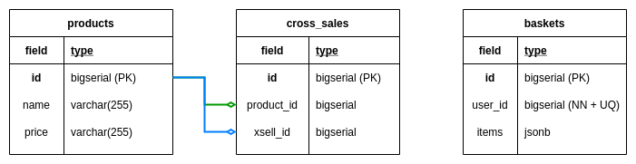

# An example of effective mutation testing in Spring Boot 3 projects with Maven


--- 

## 📋 Project Overview

This project demonstrates **why traditional code coverage tools aren't enough** to ensure test quality and how **mutation testing** can reveal weaknesses in your test suite that JaCoCo and PMD might miss.

Built as an eCommerce cross-selling API using **Spring Boot 3**, this project showcases the implementation of effective mutation testing strategies using **Pitest** with the **Descartes** mutation engine.

--- 

## 🎯 Project Goal

**Implement an eCommerce system using  Outside-In TDD approach** while demonstrating that even with high code coverage (JaCoCo) and static analysis (PMD), your tests might not be as robust as you think.

**Mutation testing reveals the truth about test quality.**

--- 

## 🏗️ Architecture & Technologies

### Core Technologies
- **Java 21**
- **Spring Boot 3.5.5**
- **Spring Data JPA** for data persistence
- **PostgreSQL** as the primary database
- **Flyway** for database migrations
- **Testcontainers** for integration testing

### Code Quality & Testing Stack
- **JaCoCo** - Traditional code coverage (shows what lines are executed)
- **PMD** - Static code analysis (finds potential bugs and code smells)
- **PITest with Descartes** - Mutation testing (reveals if your tests actually validate behavior)
- **ArchUnit** - to check that the rules for the layers of Hexagonal Architecture are respected
- **Spotless** - Code formatting

### Additional Tools
- **MapStruct** - Bean mapping
- **Lombok** - Boilerplate code reduction
- **OpenAPI Generator** - API documentation and client generation
- **Swagger/OpenAPI** - API documentation

--- 

## 📋 Requirements

--- 

### 🎯 Functional Requirements

#### 1. We have an eCommerce Rest API with the following endpoints:

- GET /api/products

- GET /api/products/{productId}

- GET /api/users/{userId}/basket

- POST /api/users/{userId}/basket

#### 2. When we enter the products page, the list of all products is returned to us:

- GET /api/products
```json
[
  {
    "id": 1,
    "name": "Dell Latitude 3301 Intel Core i7-8565U/8GB/512GB SSD/13.3",
    "price": "999,00 €"
  },
  {
    "id": 2,
    "name": "Samsonite Airglow Laptop Sleeve 13.3",
    "price": "41,34 €"
  },
  {
    "id": 3,
    "name": "Logitech Wireless Mouse M185",
    "price": "10,78 €"
  },
  {
    "id": 4,
    "name": "Fellowes Mouse Pad Black",
    "price": "1,34 €"
  }
]
```

#### 3. When we obtain a product by its ID, the related products are returned next to it:

- GET /api/products/{productId}
```json
{
  "product": {
    "id": 1,
    "name": "Dell Latitude 3301 Intel Core i7-8565U/8GB/512GB SSD/13.3",
    "price": "999,00 €"
  },
  "cross_selling": [
    {
      "id": 2,
      "name": "Samsonite Airglow Laptop Sleeve 13.3",
      "price": "41,34 €"
    },
    {
      "id": 3,
      "name": "Logitech Wireless Mouse M185",
      "price": "10,78 €"
    }
  ]
}
```

#### 4. We can get a user's basket by their **ID**.

- GET /api/users/{userId}/basket
```json
{
  "id": 1,
  "userId": 1,
  "items": {
    "products": [
      {
        "id": 3,
        "name": "Logitech Wireless Mouse M185",
        "price": "10,78 €"
      }
    ]
  }
}
```

#### 5. If the customer does not have a basket with products, is returned `HttpStatus.NOT_FOUND`.

#### 6. We can add products to this basket with POST and the payload:

- POST /api/users/{userId}/basket
```json
{
  "id": 3,
  "name": "Logitech Wireless Mouse M185",
  "price": "10,78 €"
}
```

#### 8. When we add a product to a basket and the basket does not exist, it is created automatically and the product is added successfully.

#### 9. When we add a product, it already exists in the basket, it is not added.

#### 10. Use PostgreSQL to save the data.


#### 11. Use native queries to manage cross-sell data.

#### 12. This is the example of the [table creations](src/main/resources/db/migration/V001__CREATE_SCHEMA.sql).

--- 

### ⏱️ Non-Functional Requirements

- **Test Coverage**: Minimum 80% line coverage
- **Mutation Coverage**: Minimum 80% mutation score
- **Static Analysis**: Zero PMD violations
- **Code Style**: Consistent formatting enforced by Spotless
- **Architecture**: Implement a hexagonal architecture with proper layer separation

--- 

## 🚀 Getting Started

--- 

### Prerequisites

- **Java 21** or higher
- **Docker** (for PostgreSQL and Testcontainers)
- **Maven 3.9.x** (wrapper included)

--- 

### Build the project

```shell
./mvnw clean package
```

### 🛠️ Running Tests & Quality Checks

#### Standard Test Execution
```bash
./mvnw test
```

#### Generate JaCoCo coverage report
```bash
./mvnw jacoco:report
```

#### View JaCoCo coverage report
```shell
open target/site/jacoco/index.html
```

#### Check minimum coverage
```shell
./mvnw jacoco:check
```

#### Check code style and formatting rules
```bash
./mvnw spotless:check
```

#### Check PMD rules
```bash
./mvnw pmd:check
```

#### Verify everything 
Runs all checks to ensure the project is valid, tests pass, and quality rules, such as code coverage and PMD rules, are met.
```bash
./mvnw clean verify
```


### Mutation Testing

#### Run the mutation tests
```shell
 ./mvnw pitest:mutationCoverage
```

####  View detailed mutation report
```shell
open target/pit-reports/index.html
```

--- 

## Docker

### Build Docker image:
```shell
docker build -t mutation-testing-with-maven .
```

### Create and run a new container from an image:
```shell
docker run -d -p 8080:8080 --name mutation-testing-with-maven mutation-testing-with-maven
```

### Run with docker compose

```shell
docker compose up -d
```

### Access
URL to access to [Swagger UI](http://localhost:8080/api/swagger-ui.html)


### Stop docker containers:
```shell
docker compose down -v
```

--- 

## 🎯 Key Learning Outcomes

By exploring this project, you'll understand:

1. **Why 100% code coverage can be misleading**
2. **How mutation testing reveals test weaknesses that traditional metrics miss**
3. **The difference between testing code execution vs. testing behavior**
4. **Practical strategies for writing more effective tests**

--- 

## 🤝 Contributing

1. Fork the repository
2. Create a feature branch (`git checkout -b feature/amazing-feature`)
3. Write tests first (TDD approach)
4. Ensure all quality gates pass (`./mvnw clean verify`)
5. Commit your changes (`git commit -m 'Add some amazing feature'`)
6. Push to the branch (`git push origin feature/amazing-feature`)
7. Open a Pull Request

--- 

### Quality Standards
- Minimum 80% line coverage (JaCoCo)
- Minimum 80% mutation coverage (PITest)
- All PMD rules must pass
- All tests must be green

--- 

## 📚 Further Reading

- [PITest Official Documentation](https://pitest.org/)
- [Descartes Mutation Engine](https://github.com/STAMP-project/pitest-descartes) - Extreme mutation testing
- [Mutation Testing: A Comprehensive Guide](https://github.com/ismail2ov/mutation-testing-guide)
- [Why Code Coverage is Not Enough](https://martinfowler.com/bliki/TestCoverage.html)

--- 

## 📝 License

This project is licensed under the MIT License - see the [LICENSE](LICENSE) file for details.

--- 

⭐ **If this project helped you understand mutation testing better, please give it a star!**

> "Code coverage tells you what code your tests execute. Mutation testing tells you if your tests actually validate anything meaningful." - The Art of Testing